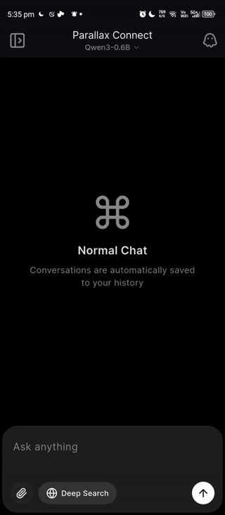
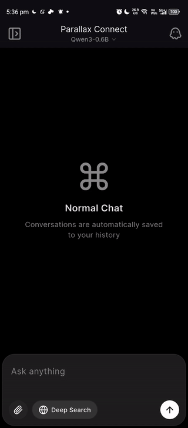

<p align="center">
  
</p>

<h1 align="center">Parallax Connect</h1>

<p align="center">
  <strong>Your Personal AI Cloud — Mobile Access to Your Local GPU</strong>
</p>

<p align="center">
  <a href="#-features">Features</a> •
  <a href="#-quick-start">Quick Start</a> •
  <a href="#-architecture">Architecture</a> •
  <a href="#-documentation">Docs</a> •
  <a href="https://youtu.be/1G5gAEA_tz8">📺 Demo Video</a>
</p>

<p align="center">
  
  
  
  
</p>

---

## 🏆 Built for the Parallax Hackathon

This project was built for the **"Build your own AI lab"** competition hosted by [Gradient](https://gradient.network/) and [TheAhmadOsman](https://x.com/TheAhmadOsman).

**Track 2 Submission**: Building Applications — Demonstrating how local AI can solve real problems with privacy and cost-efficiency at its core.

> 🌱 **This is just the beginning.** Parallax Connect will continue to evolve with multi-device sync, enhanced security, and community-driven features. Join us in shaping the future of personal AI!

---

## ✨ Features

<table>
<tr>
<td width="50%" valign="top">

### 💬 Smart Chat

- Real-time **streaming responses**
- Markdown rendering with code highlighting
- Multi-turn conversations with context
- OpenAI-compatible API

### 🔍 Intelligent Web Search

- **3 depth levels**: Normal → Deep → Deeper
- DuckDuckGo & Brave providers
- Source attribution with clickable links
- Smart query routing

</td>
<td width="50%" valign="top">

### 👁️ Vision & OCR

- **Edge mode**: On-device ML Kit
- **Server mode**: PaddleOCR / EasyOCR
- Image analysis with context-aware prompts
- Automatic pipeline selection

### 📄 Document Processing

- PDF text extraction (PyMuPDF)
- Smart context chunking
- Mobile or server-side processing
- Document-aware responses

</td>
</tr>
</table>

<br/>

<p align="center">
  🔐 <strong>Built for Privacy</strong> — Password protection • Local network mode • Cloud via ngrok • Zero telemetry
</p>

---

## 🚀 Quick Start

<table>
<tr>
<td width="60%">

### Prerequisites

- Computer with **NVIDIA GPU** (Windows/Linux)
- [Python 3.10+](https://www.python.org/downloads/)
- [Parallax](https://github.com/GradientHQ/parallax) running (`parallax run`)

### Installation

```bash
# Clone the repository
git clone https://github.com/ManishModak/parallax-connect-mobile.git
cd parallax-connect-mobile

# Install dependencies (use virtual env recommended)
pip install -r requirements.txt

# Start the server
python run_server.py
```

> 💡 **Tip**: We recommend using a virtual environment. See [Server Setup Guide](SERVER_SETUP.md#step-3-create-a-virtual-environment-recommended) for detailed instructions.

### Connect Your Phone

1. **Scan** the QR code displayed in terminal
2. **Chat** — your AI is ready!

</td>
<td width="40%" align="center">


</td>
</tr>
</table>

---

## 🏗️ Architecture

```
┌─────────────────┐     QR Scan      ┌──────────────────┐     REST API     ┌─────────────┐
│   Mobile App    │ ───────────────► │   Python Server  │ ───────────────► │  Parallax   │
│    (Flutter)    │ ◄─── streaming ── │    (FastAPI)     │ ◄── inference ── │ (Local GPU) │
└─────────────────┘                  └──────────────────┘                  └─────────────┘
                                              │
                              ┌───────────────┼───────────────┐
                              ▼               ▼               ▼
                         🔍 Search      👁️ Vision       📄 Documents
```

| Component | Role |
|-----------|------|
| **Parallax** | Serves open-source LLMs on your local GPU |
| **Python Middleware** | Adds web search, vision, and document capabilities |
| **Flutter App** | Connects via QR code for seamless mobile access |

---

## 🔑 API Endpoints

| Endpoint | Description |
|:---------|:------------|
| `POST /chat` | Synchronous chat |
| `POST /chat/stream` | Server-sent events streaming |
| `POST /vision` | Image + OCR → LLM analysis |
| `POST /search` | Web search (normal/deep/deeper) |
| `GET /models` | List available models |
| `GET /info` | Server capabilities |
| `POST /v1/chat/completions` | OpenAI-compatible endpoint |

---

## 📱 Mobile App

<p align="center">
  <a href="https://drive.google.com/file/d/1Rt_so8tpFoaGFlQLx14yIMJkE66vGH2N/view?usp=drive_link">
    
  </a>
  &nbsp;&nbsp;
  <a href="https://github.com/ManishModak/parallax-connect/releases">
    
  </a>
</p>

<p align="center">
  
  &nbsp;&nbsp;
  
  &nbsp;&nbsp;
  
</p>

<p align="center">
  <strong>QR Scanner</strong> • <strong>Local & Cloud Modes</strong> • <strong>Settings Panel</strong> • <strong>Chat History</strong> • <strong>Dark Theme</strong>
</p>

---

## 📚 Documentation

| Guide | Description |
|:------|:------------|
| [Server Setup](SERVER_SETUP.md) | Installation, modes, ngrok, security |
| [Usage Guide](SERVER_USAGE_GUIDE.md) | API endpoints, payloads, examples |
| [Mobile App](app/README.md) | Build, run, configuration |

---

## 🛠️ Troubleshooting

<details>
<summary><strong>❌ "Cannot connect to Parallax"</strong></summary>
<br/>
Ensure Parallax is running: <code>parallax run</code>
</details>

<details>
<summary><strong>❌ "Connection refused" on mobile</strong></summary>
<br/>

- Check firewall allows Python on port 8000
- Ensure phone is on same WiFi network
- Try Cloud Mode with ngrok

</details>

<details>
<summary><strong>❌ "Port already in use"</strong></summary>
<br/>
Another process is using port 8000. Close it or restart your computer.
</details>

---

<h2 align="center">❤️ Why Local AI Matters ❤️</h2>

<p align="center">
  <strong>Private</strong> — Your data never leaves your machine<br/>
  <strong>Cost-effective</strong> — Zero API costs after hardware<br/>
  <strong>Accessible</strong> — Mobile access from anywhere<br/>
  <strong>Powerful</strong> — Full LLM + web search + vision
</p>

---

<p align="center">
  Built with ❤️ for the Local AI Community
</p>

<p align="center">
  <a href="https://github.com/GradientHQ/parallax">Parallax</a> •
  <a href="https://gradient.network/">Gradient</a>
</p>
