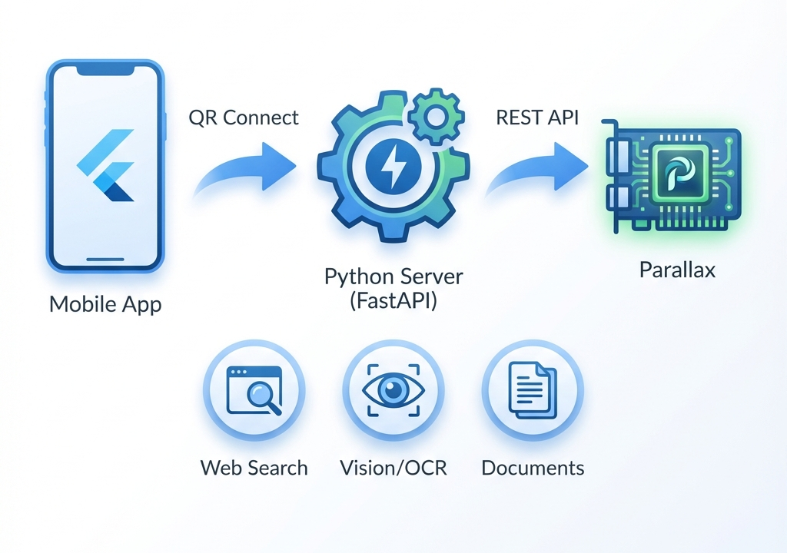

<p align="center">
  
</p>

<h1 align="center">Parallax Connect</h1>

<p align="center">
  <strong>Your Personal AI Cloud — Mobile Access to Your Local GPU</strong>
</p>

<p align="center">
  <a href="#-features">Features</a> •
  <a href="#-quick-start">Quick Start</a> •
  <a href="#-architecture">Architecture</a> •
  <a href="#-documentation">Docs</a>
</p>

<p align="center">
  
  
  
  
</p>

---

## 🎯 Why Parallax Connect?

Run a **private, self-hosted AI assistant** from your own GPU and access it from anywhere via mobile — no cloud APIs, no subscriptions, **your data stays yours**.

| Problem | Solution |
|---------|----------|
| Cloud AI is expensive | Run on your own GPU — **zero inference costs** |
| Privacy concerns | All data stays local — **never leaves your machine** |
| Limited mobile access | QR scan & go — **instant connection** |
| Complex setup | One command — **`python run_server.py`** |

---

## ✨ Features

<table>
<tr>
<td width="50%">

### 💬 Smart Chat

- Real-time **streaming responses**
- Markdown rendering with code highlighting
- Multi-turn conversations with context
- OpenAI-compatible API (`/v1/chat/completions`)

### 🔍 Intelligent Web Search

- **3 depth levels**: Normal → Deep → Deeper
- DuckDuckGo & Brave providers
- Source attribution with clickable links
- Smart query routing

</td>
<td width="50%">

### 👁️ Vision & OCR

- **Edge mode**: On-device ML Kit processing
- **Server mode**: PaddleOCR / EasyOCR
- Image analysis with context-aware prompts
- Automatic pipeline selection

### 📄 Document Processing

- PDF text extraction (PyMuPDF)
- Smart context chunking
- Mobile or server-side processing
- Document-aware responses

</td>
</tr>
</table>

### 🔐 Built for Privacy

- Optional **password protection** on all endpoints
- Local network mode (same WiFi)
- Cloud mode via **ngrok** tunnel
- Zero telemetry by default

---

## 🚀 Quick Start

### Prerequisites

- Computer with **NVIDIA GPU** (Windows/Linux)
- [Python 3.10+](https://www.python.org/downloads/)
- [Parallax](https://github.com/GradientHQ/parallax) running (`parallax run`)

### Installation

```bash
# Clone the repository
git clone https://github.com/ManishModak/parallax-connect.git
cd parallax-connect

# Install dependencies
pip install -r requirements.txt

# Start the server
python run_server.py
```

### Connect Your Phone

1. **Scan** the QR code displayed in terminal
2. **Chat** — your AI is ready!

<!-- TODO: Add screenshot of QR code in terminal -->
<!--  -->

---

## 🏗️ Architecture

```
┌─────────────────┐     QR Scan      ┌──────────────────┐     REST API     ┌─────────────┐
│   Mobile App    │ ───────────────► │   Python Server  │ ───────────────► │  Parallax   │
│    (Flutter)    │ ◄─── streaming ── │    (FastAPI)     │ ◄── inference ── │ (Local GPU) │
└─────────────────┘                  └──────────────────┘                  └─────────────┘
                                              │
                              ┌───────────────┼───────────────┐
                              ▼               ▼               ▼
                         🔍 Search      👁️ Vision       📄 Documents
                        (Web scraping)  (OCR engines)  (PDF extraction)
```

**How it works:**

1. **Parallax** serves open-source LLMs on your local GPU
2. **Python middleware** adds web search, vision, and document capabilities
3. **Flutter app** connects via QR code for seamless mobile access

---

## 🔑 API Endpoints

| Endpoint | Description |
|----------|-------------|
| `POST /chat` | Synchronous chat |
| `POST /chat/stream` | Server-sent events streaming |
| `POST /vision` | Image + OCR → LLM analysis |
| `POST /search` | Web search (normal/deep/deeper) |
| `GET /models` | List available models |
| `GET /info` | Server capabilities |
| `POST /v1/chat/completions` | OpenAI-compatible endpoint |

---

## 📱 Mobile App Features

- **QR Code Scanner** — Instant connection
- **Dual Modes** — Local WiFi or ngrok Cloud
- **Settings Panel** — Search depth, OCR mode, response style
- **Chat History** — Local storage with export
- **Dark Theme** — OLED-optimized UI

<!-- TODO: Add app screenshots -->
<!-- 
<p align="center">
  
  
  
</p>
-->

---

## 📚 Documentation

| Guide | Description |
|-------|-------------|
| [Server Setup](SERVER_SETUP.md) | Installation, modes, ngrok, security |
| [Usage Guide](SERVER_USAGE_GUIDE.md) | API endpoints, payloads, examples |
| [Mobile App](app/README.md) | Build, run, configuration |

---

## 🛠️ Troubleshooting

<details>
<summary><strong>"Cannot connect to Parallax"</strong></summary>

Ensure Parallax is running: `parallax run`
</details>

<details>
<summary><strong>"Connection refused" on mobile</strong></summary>

- Check firewall allows Python on port 8000
- Ensure phone is on same WiFi network
- Try Cloud Mode with ngrok

</details>

<details>
<summary><strong>"Port already in use"</strong></summary>

Another process is using port 8000. Close it or restart your computer.
</details>

---

## 🏆 Built for [Parallax Hackathon](https://gradient.network/)

This project demonstrates how **local AI** can be:

- **Private** — Your data never leaves your machine
- **Cost-effective** — Zero API costs after hardware
- **Accessible** — Mobile access from anywhere
- **Powerful** — Full LLM capabilities + web search + vision

---

<p align="center">
  Built with ❤️ for the Local AI Community
</p>

<p align="center">
  <a href="https://github.com/GradientHQ/parallax">Parallax</a> •
  <a href="https://gradient.network/">Gradient</a>
</p>
